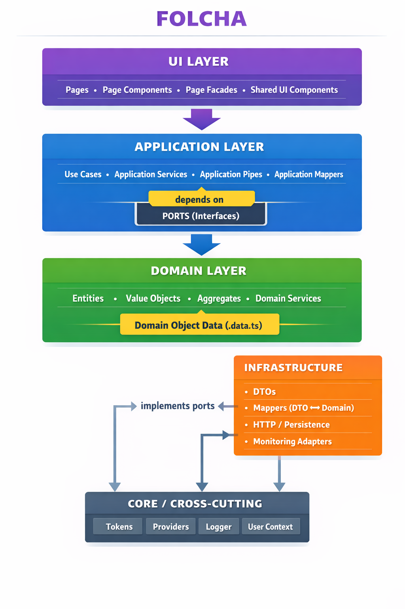

# FOLCHA Architecture

## Feature-Oriented Layered Clean Hexagonal Architecture

---

## 1. What is FOLCHA?

**FOLCHA** stands for:

> **Feature-Oriented Layered Clean Hexagonal Architecture**

It is a **composed frontend architecture** that intentionally combines the strongest, most battle-tested ideas from multiple architectural paradigms into a single, strict, and predictable system.

FOLCHA is designed for:
- Large applications
- Long-lived codebases
- Strong domain boundaries
- High testability
- AI-assisted development

It is not experimental.  
It is **a deliberate synthesis of proven architectures**.

---

## 2. Architectures Combined in FOLCHA

FOLCHA integrates four architectural approaches:

### 2.1 Feature-Oriented Architecture
### 2.2 Layered Architecture
### 2.3 Clean Architecture
### 2.4 Hexagonal Architecture (Ports & Adapters)

Each of them solves a real problem.  
FOLCHA combines them **without contradiction**.

---

## 3. Why Feature-Oriented?

### 3.1 The problem with layer-first structures

Traditional frontend structures:

components/
services/
models/

cause:
- Cross-feature coupling
- Unclear ownership
- Difficult refactoring
- Poor scalability
- Hard navigation

Logic for one feature is scattered across the entire project.

---

### 3.2 Feature-Oriented solution

In FOLCHA, **a feature is the primary unit of organization**.

feature/
user/
auth/
profile/

Each feature:
- Owns its logic end-to-end
- Can be developed independently
- Can be tested independently
- Can be removed with minimal impact

> Features scale better than layers.

---

## 4. Layers Inside a Feature

Each feature is internally split into strict layers:

feature/<feature-name>/
domain/
application/
infrastructure/
pages/
facade/
ui/

This gives:
- Clear responsibilities
- Controlled dependencies
- Predictable file locations

---

## 5. Dependency Rule (Most Important Rule)

**Dependencies always point inward.**

UI → Facade → Application → Domain
Infrastructure → Application → Domain

Never the opposite.

This rule guarantees:
- Stability
- Testability
- Framework independence

---

## 6. Domain Layer

### Purpose
The **Domain** layer contains pure business logic.

### Characteristics
- No Angular
- No RxJS
- No HTTP
- No side effects
- No framework imports

### Contains
- Entities
- Value objects
- Domain errors
- Domain rules
- Domain repositories (interfaces)

### Why it exists
> Business rules must survive framework changes.

The domain is the **most protected and stable** part of the system.

---

## 7. Application Layer

### Purpose
The **Application** layer orchestrates business workflows.

It answers:
> “What happens when the user does X?”

### Contains
- Use cases
- Commands
- Application errors
- Ports (interfaces)
- Tokens
- View models (VMs)
- Pipes (mapping, error translation)
- `.data.ts` structures

### What `.data.ts` files are

`.data.ts` files represent **transport / persistence data shapes**.

They are:
- Not domain models
- Not UI models
- Explicit boundaries between layers

They protect the domain from leaking infrastructure details.

---

### Why Application is separate from Domain

- Domain defines **rules**
- Application defines **flows**
- Application coordinates multiple domain operations

---

## 8. Hexagonal Architecture in FOLCHA

Hexagonal architecture introduces **Ports & Adapters**.

### Ports
- Live in `domain` or `application`
- Define what the system needs
- Pure TypeScript interfaces

### Adapters
- Live in `infrastructure`
- Implement ports
- Talk to real systems (HTTP, storage, monitoring)

> Infrastructure depends on application, never the opposite.

---

## 9. Infrastructure Layer (Feature-Level)

### Purpose
The **Infrastructure** layer implements technical details.

### Contains
- HTTP repositories
- API adapters
- Monitoring implementations
- Logging implementations
- External service integrations

### Rules
- Implements ports
- No business logic
- Replaceable
- Testable with mocks

Infrastructure is **an implementation detail**, not a core concern.

---

## 10. Core Infrastructure (Shared)

### `core/providers`
- Angular providers
- Dependency wiring
- DI composition

### `core/infrastructure/http`
- HTTP clients
- API base configuration
- Interceptors

### `core/infrastructure/monitoring`
- Logging
- User context
- Error reporting

These are **cross-feature technical concerns**, not business logic.

---

## 11. UI, Pages and Facades

### Pages
- Route-level components
- Page composition
- No business logic

### UI
- Pure presentational components
- Dumb components
- Inputs / Outputs only

### Facade
- Feature entry point for UI
- Talks to use cases
- Exposes observables / VMs
- Manages page state

> UI never talks directly to application or infrastructure.

---

## 12. Shared Layer

### `shared/ui`
- Design system components
- Buttons, inputs, layouts
- No feature logic

### `shared/utils`
- Pure helpers
- Stateless functions

Shared code must:
- Be generic
- Be reusable
- Have no feature knowledge

---

## 13. Testing Strategy in FOLCHA

### Domain
- Pure unit tests
- Fast
- Deterministic

### Application
- Use case tests
- Port mocking
- Error mapping tests

### Infrastructure
- Adapter tests
- HTTP mocking

### UI / Facade
- Facade logic tests
- Minimal component tests

> Most logic is tested **without Angular TestBed**.

---

## 14. Comparison with Other Architectures

### MVC
❌ Fat controllers  
❌ Logic mixed with UI  

**FOLCHA:** strict separation, no logic in UI

---

### MVVM
❌ ViewModels become domain logic  
❌ Domain erosion  

**FOLCHA:** VM is presentation-only

---

### Classic Clean Architecture
❌ Weak feature boundaries  

**FOLCHA:** feature-first + clean rules

---

### Pure Hexagonal
❌ Over-abstracted for frontend  

**FOLCHA:** pragmatic hexagonal usage

---

## 15. Pros and Cons

### Pros
✅ Strong boundaries  
✅ High testability  
✅ Clear ownership  
✅ Scales with teams  
✅ Easy refactoring  
✅ Framework-independent  
✅ AI-friendly  

### Cons
⚠️ More files  
⚠️ Requires discipline  
⚠️ Higher entry threshold  

These are **intentional trade-offs**.

---

## 16. Is FOLCHA Proven?

FOLCHA is built from:
- Clean Architecture (Uncle Bob)
- Hexagonal Architecture (Cockburn)
- Feature-Sliced Design
- DDD tactical patterns

Each of these is:
- Industry-proven
- Widely adopted
- Battle-tested

FOLCHA does not invent new theory.  
It **correctly composes existing ones**.

---

## 17. Why FOLCHA is Ideal for AI-Assisted Development

AI performs best when:
- Structure is predictable
- Rules are explicit
- Responsibilities are clear

FOLCHA provides:
- Deterministic file locations
- Strict dependency rules
- Clear layer intent

This allows AI to:
- Generate correct code
- Refactor safely
- Reason architecturally

> FOLCHA turns AI into an **architectural assistant**, not a random code generator.

---

## 18. Layered Presentation (Text Version)

### Slide 1 — Title
FOLCHA Architecture

### Slide 2 — Problem
Growing complexity, tight coupling, poor scalability

### Slide 3 — Core Idea
Feature-first, layered, clean, hexagonal

### Slide 4 — Feature Orientation
Vertical slices, clear ownership

### Slide 5 — Layers
Domain → Application → Infrastructure → UI

### Slide 6 — Domain
Pure business rules

### Slide 7 — Application
Use cases and orchestration

### Slide 8 — Hexagonal
Ports and adapters

### Slide 9 — Infrastructure
Replaceable technical details

### Slide 10 — UI & Facades
Rendering and coordination only

### Slide 11 — Why It Works
Predictable, testable, scalable

### Slide 12 — AI Compatibility
Architecture as a contract

### Slide 13 — Conclusion
Built for longevity

---

## 19. Final Statement

> Architecture is not about speed today.  
> It is about freedom tomorrow.

FOLCHA is designed for systems that must:
- Grow
- Be maintained
- Be understood by humans and AI alike

